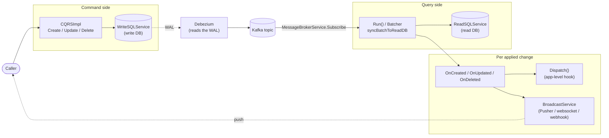
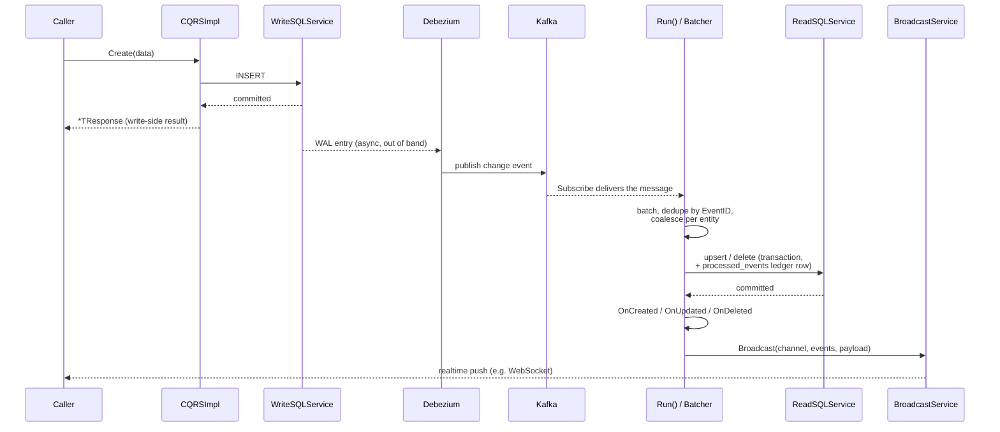
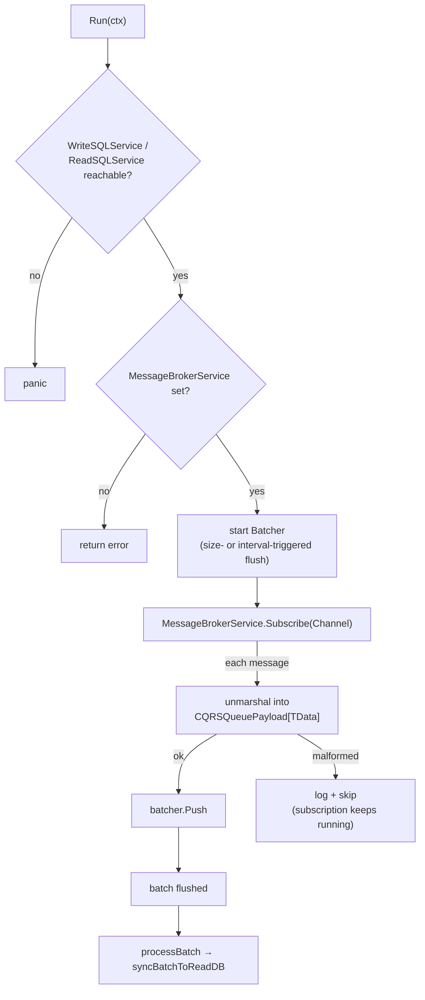
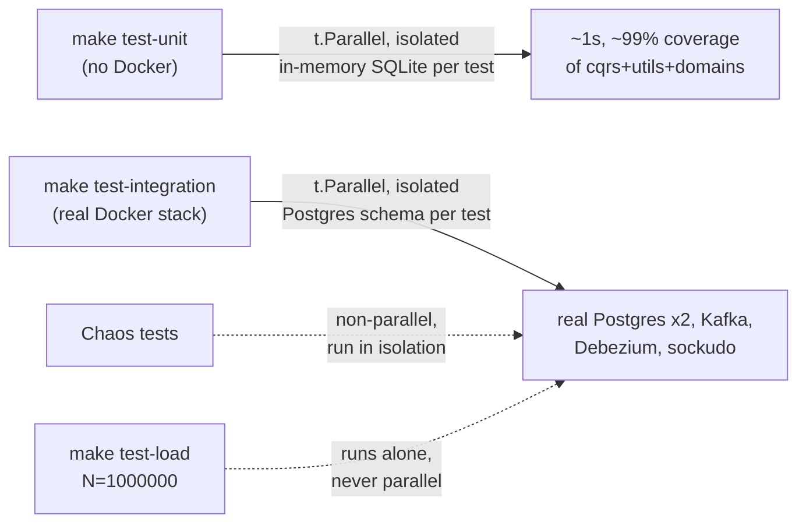

# cqrs-go

A generic, type-safe Go implementation of the CQRS (Command Query
Responsibility Segregation) pattern: a write path with real Create/Update/
Delete methods, a CDC (Change Data Capture) ingestion loop that replicates
every write into a separate read model, and a realtime broadcast hook fired
per applied change. It ships as a small, dependency-light **engine** —
`src/cqrs` + `src/domains` + `src/utils` only. It does not ship a Kafka
client, a Postgres driver choice, or a push-notification adapter; you inject
those through three plain interfaces.

## Why this exists

Splitting "the database you write to" from "the database you read from" is
a standard scaling move — the write side can stay small and strict
(normalized, heavily indexed for writes, transactional), while the read
side can be shaped however queries actually need it (denormalized,
optimized for the exact access patterns a UI or API needs, scaled
independently). The hard part was never the idea; it's keeping the two
sides **consistent** without turning every write into a distributed
transaction.

The naive fix — write to both databases in the same request — is a
correctness trap: if the second write fails, silently loses a network
packet, or the process crashes between the two calls, the databases
disagree and nothing tells you. This library takes the other, safer
approach: **write once, to one database, and let CDC (via Debezium reading
the write database's WAL) propagate that change everywhere else.** A change
either committed to the write DB and *will* eventually reach the read DB,
or it never committed at all — there's no in-between state where a caller
believed a write succeeded but the read side never found out.

On top of that CDC pipe, this library adds the parts every team ends up
hand-rolling anyway:

- **Idempotency.** Kafka (and CDC pipelines generally) deliver at-least-once,
  not exactly-once. A redelivered event is silently deduplicated against a
  `processed_events` ledger before it can be applied twice.
- **Entity-level coalescing.** If the same row changes several times within
  one flushed batch (an update immediately followed by a delete, say), only
  the final state is written to the read DB — not every intermediate one.
  Fewer redundant writes under real load, and no window where the read side
  briefly shows a stale intermediate state.
- **A realtime hook that's decoupled from the write path.** `Create`/
  `Update`/`Delete` return as soon as the write DB commits — they never wait
  on Kafka, the read DB, or a push notification going out. The broadcast
  only fires once a change has actually landed in the read model, which is
  also the only point at which "the read side agrees with this change" is
  actually true.

Use this when you need a read model that's shaped differently from your
write model (a search-optimized projection, a denormalized API resource, a
reporting view), and/or a realtime "this changed" signal to push to
connected clients — without wiring CDC, idempotency, coalescing, and
broadcast fan-out from scratch for every project that needs them.

## Architecture

`Create`/`Update`/`Delete` only ever touch `WriteSQLService` and return as
soon as that commits. Everything from Debezium onward happens
asynchronously, off the caller's critical path.

### One change's full lifecycle

The caller gets a response the moment the write DB commits. The read DB and
any realtime push land later, asynchronously, once Debezium → Kafka → `Run`
has actually processed the change.

## Package layout

| Package | Responsibility |
|---|---|
| `src/cqrs` | The `CQRSImpl` engine: `Create`/`Update`/`Delete` (write path), `Run`/`processBatch`/`syncBatchToReadDB` (CDC ingestion + read-model sync), `OnCreated`/`OnUpdated`/`OnDeleted` (broadcast path), log helpers. |
| `src/domains` | Shared types: `Channel`, `Events`, `ChangeType`, `CQRSQueuePayload[T]` (the CDC envelope), `ProcessedEvent` (idempotency ledger), and the service interfaces (`SQLService`, `LogService`, `BroadcastService`, `MessageBrokerService`). |
| `src/utils` | Generic infrastructure used on the hot batching path: `Batcher` (channel + ticker batching), `BufferPool`/`MapPool` (`sync.Pool` wrappers to cut allocations), `BunColumnFieldIndex`/`FieldValueAt` (reflection over a `bun` struct tag, resolved once and cached rather than re-scanned per message). |

That's the whole shipped library. There is **no** `src/kafka`, `src/pusher`,
or `src/debezium` package — see [Bringing your own adapters](#bringing-your-own-adapters)
for why that's deliberate, not an oversight.

## `CQRSImpl[TData, TResponse, TRequest, TID]`

Type parameters:

- **`TData`** — the write-model / DB row shape (a `bun`-tagged struct).
- **`TResponse`** — the API resource shape returned to callers. `ToResource`
  converts `TData` → `*TResponse`.
- **`TRequest`** — reserved for request/DTO validation; not yet wired to any
  method.
- **`TID`** — the primary key type used by the by-ID `Update`/`Delete` calls.

Construction is via `NewCQRS(...)`, which applies defaults
(`ColumnDefaultID` → `"id"`, `ColumnDefaultSort` → `"updated_at DESC"`,
`Channel` → `"default"`, `BatchSize` → `100`, `FlushInterval` → `5s`), panics
if `WriteSQLService` is nil, and resolves `idFieldIndex` once up front (see
[Entity coalescing](#idempotency--entity-level-coalescing) below) instead of
on every message. `Channel`, `BatchSize`, and `FlushInterval` are exported
config fields that `NewCQRS` actually copies onto the returned instance —
worth calling out because at an earlier point in this project's history
`Channel` silently wasn't, which meant `Run` always subscribed to an empty
Kafka topic regardless of what was configured. Covered by a regression test
now (`TestErrorPaths_NewCQRS_PreservesChannel`).

### Config fields

| Field | Purpose |
|---|---|
| `Channel` | Kafka topic to subscribe on **and** the broadcast channel name used when pushing events out. |
| `ColumnDefaultID` | DB column name for the primary key (default `"id"`). Used both for `WHERE`/`WherePK()` clauses and to resolve which `TData` field is the entity ID. |
| `ColumnDefaultSort` | Default ordering for read queries (default `"updated_at DESC"`). |
| `Preloads` | Reserved for relation preloading; not yet consumed. |
| `ToResource func(*TData) *TResponse` | Converts a write-model row into the API resource. Called after every write, and after every CDC-applied change, before broadcasting. |
| `TocCSV func(*TData) *map[string]any` | Row → column-map converter for CSV export. Not used internally by the engine; available for callers. |
| `Created / Updated / Deleted func(*TData) domains.Events` | Per-change-type hook. Return the event names this change should be published under; return an empty/nil slice to suppress broadcasting for that specific change. |
| `Dispatch func(channel, events, payload) error` | Optional application-level pub/sub hook, called alongside `BroadcastService`. |
| `ReadSQLService` / `WriteSQLService` | The two halves of the CQRS split — query side and command side. |
| `LogService` | Structured logging (`info`/`error`/`warn`/`success`) — all four are actually wired into real code paths (`warn` on a synthesized EventID, `success` after a batch is synced), not just declared. |
| `BroadcastService` | Realtime fan-out — e.g. Pusher, websockets, or webhooks. |
| `MessageBrokerService` | `Publish`/`Subscribe` over `[]byte`; `Run()` uses it to `Subscribe` to the CDC topic. Deliberately has no method that references a concrete pub/sub client type — see below. |
| `Validator` | `go-playground/validator`; run against the payload in `Create`/`Update`. |

## Write path (commands)

Each of these validates (if `Validator` is set), executes against
`WriteSQLService` (or a supplied `bun.Tx` for the `*WithTx` variants), and
converts the result via `ToResource`:

- `Create`, `CreateMany`, `CreateWithTx`, `CreateManyWithTx`
- `UpdateByID`, `UpdateByIDWithTx`, `UpdateMany`, `UpdateManyWithTx` (bulk
  update via bun's `Bulk()` — one `UPDATE ... FROM VALUES(...)` statement
  matched by primary key, not one round trip per row — added after load
  testing showed `UpdateByID` was the one write path with no bulk option,
  see [Testing](#testing))
- `DeleteByID`, `DeleteByIDWithTx`, `DeleteMany`, `DeleteManyWithTx`

These do **not** go through the CDC/broadcast pipeline directly — that only
fires once Debezium has captured the change and it has round-tripped through
Kafka into `Run()`. There is currently no generic `Get`/`List`/`Read` on
`CQRSImpl`; reads are expected to be served directly off `ReadSQLService`
outside this engine.

## The CDC ingestion loop (`Run`)

1. Pings `WriteSQLService` (and `ReadSQLService`, if set); panics if
   unreachable.
2. Starts a `utils.Batcher[domains.CQRSQueuePayload[TData]]` — items pushed
   in are flushed either when `BatchSize` is reached or every
   `FlushInterval`, whichever comes first (see [batching.go](../src/utils/batching.go)).
3. `MessageBrokerService.Subscribe`s to `Channel`; every message is
   unmarshalled into a `CQRSQueuePayload[TData]` envelope and pushed into the
   batcher. A message that fails to unmarshal is logged and skipped — it
   does not kill the subscription.
4. Each flushed batch goes through `processBatch` → `syncBatchToReadDB`.

### `syncBatchToReadDB`

For each flushed batch:

1. Dedupe by `EventID` within the batch (Kafka/CDC redelivery guard).
2. Query `processed_events` for which of those `EventID`s were already
   applied; skip anything already processed (idempotency).
3. For everything new, collapse to **one entry per entity** — see below —
   and split into upsert vs. delete sets.
4. In a single transaction: insert the `processed_events` audit rows, bulk
   upsert (`ON CONFLICT DO UPDATE`), bulk delete (`WherePK`).
5. Return the applied messages so `processBatch` can fire the per-change
   callbacks.

### Idempotency & entity-level coalescing

If the same row changes multiple times within one flushed batch (e.g. an
update immediately followed by a delete), only the **last** `ChangeType` for
that entity is applied — this avoids redundant writes and avoids applying a
stale intermediate state. The entity key is the `TData` field whose `bun` tag
matches `ColumnDefaultID`, resolved **once** at construction time
(`utils.BunColumnFieldIndex`, cached as `idFieldIndex`) rather than
re-scanned via reflection per message; if no matching field is found, the
`EventID` is used as a fallback key. Worth noting: the *read model* only
ever reflects the coalesced final state, but every individual event in the
batch still fires its own broadcast — broadcasts are not coalesced the same
way the DB write is.

## Broadcast path (`OnCreated` / `OnUpdated` / `OnDeleted`)

For each applied message, `processBatch` calls the matching `On*` method,
which:

1. Bails out if `ToResource` is nil or the data is nil.
2. Runs asynchronously (own goroutine, with panic recovery logged via
   `LogService`, and a context detached from cancellation via
   `context.WithoutCancel` so in-flight broadcasts survive shutdown).
3. Converts the row via `ToResource`.
4. Calls the matching `Created`/`Updated`/`Deleted` callback to get the
   `domains.Events` to publish; if empty, nothing is broadcast.
5. Calls `Dispatch` (if set) and `BroadcastService.Broadcast` (if set) with
   the channel, events, and resource payload.

## Supporting infrastructure (`src/utils`)

- **`Batcher[T]`** — generic channel-based batcher backing `Run()`. Flushes
  on size or on a ticker; on `ctx` cancellation it drains whatever's left
  using an uncancelled context so in-flight DB writes still complete.
- **`BufferPool[T]` / `MapPool[K, V]`** — `sync.Pool` wrappers used to avoid
  allocating fresh slices/maps for every batch (`stringSlicePool`,
  `stringSetPool`, `processedEventsPool` on `CQRSImpl`). Oversized items
  (`cap`/`len` > 10000) are dropped rather than pooled, and pooled items are
  cleared before reuse so they don't pin stale data.
- **`BunColumnFieldIndex[T]` / `FieldValueAt[T]`** — resolves a struct
  field's index from its `bun` tag once, then reads it by index thereafter;
  avoids re-scanning struct tags on every message in the hot batching path.
  Nil pointers/interfaces/slices resolve to `""` (an absent value), not the
  literal text `"<nil>"` — a nil-pointer entity ID falls back to `EventID`
  instead of silently colliding every nil-ID row into one coalescing bucket.

## Bringing your own adapters

`domains.MessageBrokerService` and `domains.BroadcastService` are plain
interfaces over `[]byte` / `any` — nothing in either one references a
concrete Kafka, Pusher, or Postgres type. `SQLService.Client() *bun.DB` is
the one exception, and it's intentional: bun is the engine's query builder,
not swappable without a much larger redesign, so it's a real, permanent
dependency rather than a leak. (`MessageBrokerService` used to also return
a concrete `*kafka.Client`, unused anywhere in the engine — that was a
genuine leak, forcing `segmentio/kafka-go` onto every consumer of this
library whether they used Kafka or not. It's gone now; `go list -deps
./src/cqrs/...` has zero Kafka references.)

This project used to ship reference implementations of both interfaces
(`src/kafka.Broker`, backed by `segmentio/kafka-go`; `src/pusher.Broadcaster`,
for any Pusher-protocol-compatible server) plus a `src/debezium` package
transforming a real Debezium connector's output into what `Run` consumes.
They were removed on purpose: this is meant to be a library with injectable
seams, not one bundled with opinions about which Kafka client or push
provider you use. Real, working, *tested* examples of all three still exist
— they just live as test-only code in `src/regression` now
(`realKafkaGroupBroker`, `realPusherBroadcaster`, `transformDebezium` +
`runDebeziumBridge`), proven against real infrastructure (see
[Testing](#testing)) but never imported by `src/cqrs`. Read them as a
worked example for writing your own, not as code to import.

The Debezium transform specifically is worth understanding before writing
your own: a real Debezium Postgres connector's actual output is
`{before, after, source: {lsn, txId, table, ...}, op, ts_ms}` —
**not** this library's own `domains.CQRSQueuePayload` shape. Something has
to sit between Debezium's raw topic and the topic `Run` subscribes to,
mapping `op` (`"c"`/`"u"`/`"d"`/`"r"`) to `domains.ChangeType` and picking
`after` (create/update) or `before` (delete) as the payload. One real,
verified nuance: with the default `REPLICA IDENTITY` (primary key only), a
delete record's `before` only reliably contains the primary key column —
every other field comes back zero-valued. That's fine for this engine
(deletes only need the PK to remove the right row) but means that shape is
not a reliable "what did the row look like before" audit record unless the
source table has `REPLICA IDENTITY FULL` set.

## Local infrastructure (`local/docker-compose`)

A full local stack for exercising the real pipeline above: two Postgres
instances (`pgvector/pgvector:pg16`, one write/one read), Kafka + a real
Debezium Postgres connector, and sockudo (a Pusher-protocol-compatible
server) for realtime push. See `local/docker-compose/README.md` for setup,
port mapping, and the listener/schema details that took real debugging to
get right (dual Kafka listeners for host-vs-container access, the
connector's `publication.autocreate.mode`, etc.).

## Testing

- **`make test` / `make test-unit`** — the normal suite (`src/regression`,
  ~99% statement coverage of `src/cqrs`+`src/utils`+`src/domains`), no
  Docker required. Every test runs under `t.Parallel()`; each gets its own
  in-memory SQLite database, so there's nothing to contend over.
- **`make test-integration`** — brings up `local/docker-compose` (blocking
  on `docker compose up --wait` until every service is actually healthy,
  not just started) and runs the real-infra suite against it: real Postgres
  x2, real Kafka, real Debezium, real sockudo. Every test except the two
  chaos tests runs under `t.Parallel()` too, each in its own,
  freshly-created Postgres schema (`newPostgresSQLService`) rather than a
  shared table — the earlier, non-isolated version of this helper would
  have had parallel tests drop-and-recreate the same literal `widgets`
  table out from under each other. `-parallel` is pinned to a fixed value
  in the Makefile (not left to default `GOMAXPROCS`) because the per-test
  connection pool size is budgeted against that exact number, against this
  stack's actual (verified, not assumed) `max_connections=100`.
- **Chaos tests** (`integration_chaos_test.go`) deliberately don't call
  `t.Parallel()` — they restart real containers mid-test. Go's test runner
  guarantees every non-parallel top-level test runs to full completion
  before any parallel test's body starts, regardless of declaration order
  (verified empirically before relying on it) — so a container restart
  never overlaps with a parallel test hammering that same container.
- **`make test-load`** — bulk create/update/delete throughput at
  configurable scale (`make test-load N=1000000 UPDATE_N=50000` for a
  literal million-row run; defaults to 50k/5k). Runs alone, never under
  `t.Parallel()`, with a much larger connection pool than the rest of the
  suite gets (see above) since it's the one test that actually needs it.
  Logs write/publish/sync throughput per phase and asserts both databases
  end correctly empty. Representative numbers from a 1,000,000-row run on
  a 10-core machine: bulk create ~127k rows/sec written, ~57k rows/sec
  synced to the read DB; bulk delete ~220k rows/sec written, ~56k rows/sec
  synced; `UpdateByID` (no bulk API before `UpdateMany` was added) ~17k
  rows/sec via a 100-worker pool — the one write path meaningfully slower
  than the others, which is exactly what prompted adding `UpdateMany`.

## Real findings from testing this against real infrastructure

Things this project only found out by actually running against Docker,
not by reasoning about the code:

- **`Channel` wasn't being copied onto the constructed `CQRSImpl`.**
  `NewCQRS` defaulted an empty `Channel` to `"default"` but never included
  it in the returned struct literal — every constructed engine silently had
  `Channel == ""`. A real Kafka client panics on an empty topic name; the
  in-process test fake used everywhere else ignored its topic argument
  entirely, so nothing else in the suite would ever have caught it. Fixed,
  and now covered by a regression test that checks what topic `Subscribe`
  was actually called with.
- **`MessageBrokerService.Client() *kafka.Client` was dead weight that leaked
  a concrete dependency.** Never called anywhere in the engine; removed.
- **A Kafka consumer group does *not* reliably resume on its own within 30s
  of this stack's broker restarting** — a real, reproduced (not
  one-off-flaky) finding from the chaos tests. A long-lived `Subscribe`
  caller needs its own reconnect/restart supervision around `Run` for this
  failure mode; kafka-go's defaults alone weren't enough in this setup.
- **An unbounded Postgres connection pool in a test helper caused "too many
  clients already" under real concurrent load** — found by the load test's
  100-worker `UpdateByID` burst. Every real `SQLService` in this project's
  test suite now explicitly bounds its pool.
- **There was no bulk update method.** `CreateMany`/`DeleteMany` existed;
  `UpdateMany`/`UpdateManyWithTx` didn't, discovered while writing the load
  test. Added, via bun's `Bulk()`.
- **kafka-go's `Writer` can briefly see stale "topic doesn't exist"
  metadata** for a topic that was just created, because it defaults to a
  shared, process-wide `Transport` with its own metadata cache TTL. Shows
  up specifically when a second `Writer` is created moments after the
  first one in the same process (exactly what a test suite does). Worked
  around with a bounded retry on that specific error, not a general retry.

## Known gaps

- `TRequest` and `Preloads` are declared but not yet consumed anywhere.
- No generic read/list method on `CQRSImpl` — reads go directly against
  `ReadSQLService`.
- No shipped `MessageBrokerService`/`BroadcastService`/Debezium-transform
  implementation — see [Bringing your own adapters](#bringing-your-own-adapters).
  Working, tested examples exist in `src/regression`, but they're test-only
  code, not something to import.
- Chaos coverage is scoped to two scenarios (Postgres restart, Kafka broker
  restart) — connector crash-recovery, sockudo/broadcast-side failures, and
  network partitions (as opposed to full container restarts) aren't
  exercised.
